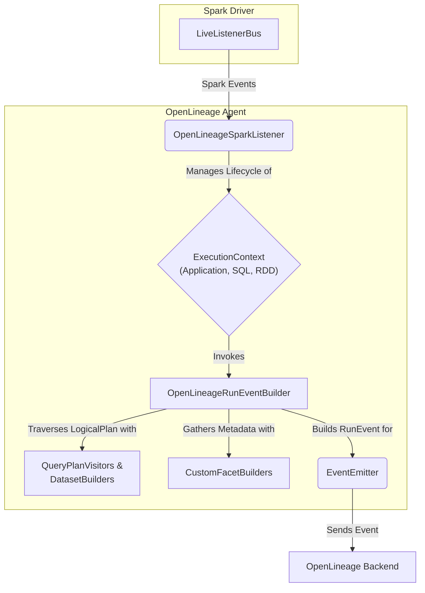
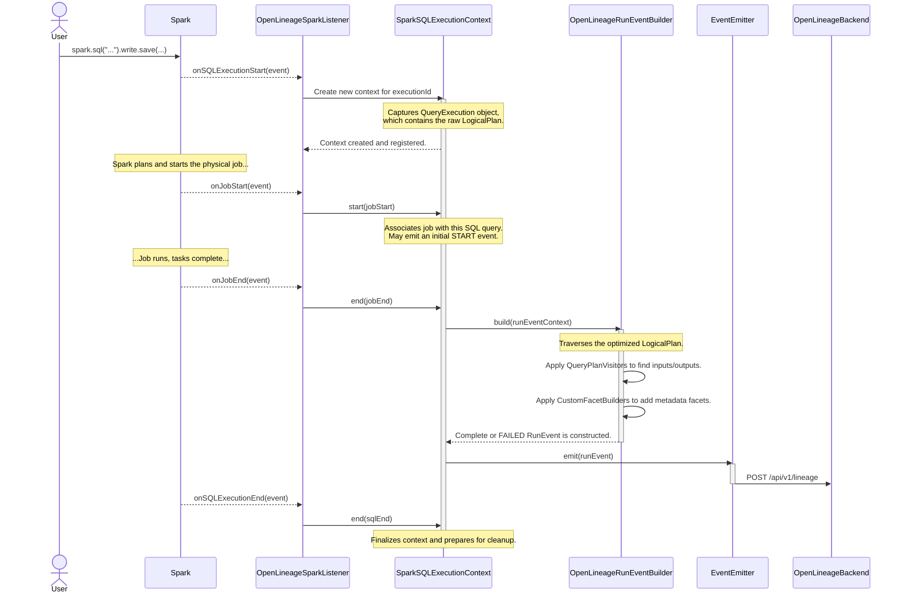

# Part 1: The Big Picture - How OpenLineage Intercepts Spark

This section provides a high-level overview of the OpenLineage Spark integration. It explains how the agent is loaded into a Spark application, introduces the core architectural components, and traces the end-to-end flow of an event from a Spark job to the OpenLineage backend.

## 1.1 The `spark-submit` Journey & Agent Initialization

The journey of capturing lineage begins the moment a user executes a `spark-submit` command. The OpenLineage agent is not a standalone process; it's a Java agent that runs inside the Spark Driver's JVM. Here's how it gets there and comes to life:

1.  **Inclusion in Classpath**: The agent, packaged as a JAR file, must be made available to the Spark application's classpath. This is typically done in one of two ways:
    *   `--jars /path/to/openlineage-spark.jar`: This command-line argument directly adds the agent JAR to the Spark Driver and Executor classpaths.
    *   `--packages io.openlineage:openlineage-spark:<version>`: This argument tells Spark to fetch the agent and its dependencies from a Maven repository.

2.  **Listener Registration**: For the agent to receive information from Spark, it needs to be registered as a `SparkListener`. This is achieved by setting a specific Spark configuration property:
    *   `--conf spark.extraListeners=io.openlineage.spark.agent.OpenLineageSparkListener`

3.  **Activation via `LiveListenerBus`**: When a `SparkSession` is initialized, Spark's `LiveListenerBus` is responsible for managing and posting events. During its setup, it reads the `spark.extraListeners` configuration. For each class listed, it uses Java reflection to create an instance of that listener. This is the moment the `io.openlineage.spark.agent.OpenLineageSparkListener` class is instantiated.

4.  **Agent Initialization Flow**:
    *   **`onApplicationStart`**: The listener remains dormant until it receives the `SparkListenerApplicationStart` event. This is the first meaningful event that signals the Spark application is ready. Inside `OpenLineageSparkListener.java`:
        ```java
        // ...
        @Override
        public void onApplicationStart(SparkListenerApplicationStart applicationStart) {
          if (isDisabled) {
            return;
          }
          log.debug("onApplicationStart()");
          initializeContextFactoryIfNotInitialized(applicationStart.appName());
          getSparkApplicationExecutionContext().start(applicationStart);
        }
        // ...
        ```
    *   **Context Factory Creation**: Inside the `onApplicationStart` method, the listener calls `initializeContextFactoryIfNotInitialized`. This critical method, shown below, performs the main setup:
        ```java
        // In OpenLineageSparkListener.java
        private void initializeContextFactoryIfNotInitialized(SparkConf sparkConf, String appName) {
          if (contextFactory == null) {
            // 1. Parse config from SparkConf, YAML, or environment variables
            SparkOpenLineageConfig openLineageConfig = ArgumentParser.parse(sparkConf);
            
            // 2. Initialize the client and emitter
            EventEmitter emitter;
            try {
              emitter = new EventEmitter(openLineageConfig, appName);
            } catch (URISyntaxException e) {
              log.error("Unable to create OpenLineage emitter", e);
              return;
            }
            
            // 3. Create the factory that will produce ExecutionContexts
            contextFactory = new ContextFactory(emitter, meterRegistry, openLineageConfig);
            log.info("OpenLineage listener context initialized.");
          }
        }
        ```
        This method orchestrates three key setup classes:
        *   **`ArgumentParser`**: This utility class is responsible for reading all `spark.openlineage.*` configurations. It follows a clear precedence: SparkConf > environment variables > YAML file (`openlineage.yml`). This hierarchical approach allows for flexible configuration management.
        *   **`EventEmitter`**: This class is the bridge to the outside world. It initializes the `OpenLineageClient`, which configures the underlying HTTP client (e.g., setting the target URL, authentication headers, timeouts) based on the parsed configuration. It also holds critical metadata like the `jobNamespace` and `parentRunId`.
        *   **`ContextFactory`**: This factory is responsible for creating and managing different `ExecutionContexts` throughout the application's lifecycle. It is injected with the `EventEmitter` so that all created contexts can send events.
    *   **Application-Level Lineage**: Once the `ContextFactory` is ready, a `SparkApplicationExecutionContext` is created. This context immediately builds and emits a `START` event for the entire Spark application run, establishing the parent run under which all subsequent job runs will be nested.

## 1.2 Core Components & High-Level Architecture

The OpenLineage Spark agent is composed of several key components that work together to capture, process, and emit lineage events.



### Component Responsibilities

*   **`Spark Driver / LiveListenerBus`**: The heart of Spark's monitoring system. It emits a stream of events about the application's status, such as when a job, stage, or SQL query starts and ends. The agent is a passive observer of this stream.
*   **`OpenLineageSparkListener`**: The agent's main entry point. It implements `org.apache.spark.scheduler.SparkListener` to subscribe to the event stream from the `LiveListenerBus`. Its primary role is to delegate these events to the appropriate `ExecutionContext` and manage their lifecycles. It acts as a singleton within the Spark driver.
*   **`ExecutionContext`**: A state-holding object that manages the context of a specific Spark execution unit. This is a crucial concept for isolating lineage correctly. The main implementations are:
    *   `SparkApplicationExecutionContext`: Manages the overall application run. Its scope is the entire `SparkSession`.
    *   `SparkSQLExecutionContext`: Manages a single Spark SQL query (`spark.sql(...)`), capturing its `QueryExecution` object which contains the all-important logical plan. Its scope is tied to a single `executionId`.
    *   `RddExecutionContext`: A fallback for low-level RDD jobs that do not have a `QueryExecution`. Its scope is tied to a single Spark `jobId`.
*   **`OpenLineageRunEventBuilder`**: The core orchestrator for constructing an `OpenLineage.RunEvent`. When an execution context (like a SQL query) finishes, this builder is invoked. It traverses Spark's `LogicalPlan`, applies visitors to identify inputs and outputs, invokes facet builders to gather extra metadata, and assembles the final, complete event.
*   **`QueryPlanVisitor`s & `DatasetBuilder`s**: These are specialized, resilient components built using Scala's `PartialFunction`. They know how to inspect specific nodes within Spark's `LogicalPlan` tree (e.g., a `HiveTableRelation` or an `InsertIntoHadoopFsRelationCommand`). Their sole purpose is to extract `InputDataset` and `OutputDataset` objects, which represent the sources and sinks of data. `DatasetBuilder`s are a more powerful variant, often triggered by events and capable of inspecting the entire execution context, not just a single plan node.
*   **`CustomFacetBuilder`s**: Facets are structured JSON snippets that attach rich, domain-specific metadata to OpenLineage events. These builders are also `PartialFunction`s that listen for various events or plan nodes to construct and attach these facets. Examples include the `ErrorFacetBuilder` for failed jobs or the `OutputStatisticsOutputDatasetFacetBuilder` for capturing row counts and file sizes.
*   **`EventEmitter`**: The final link in the chain. This component takes a fully-formed `RunEvent`, serializes it to JSON, and sends it to the configured OpenLineage backend via the `OpenLineageClient`. Its `emit()` method is the last step within the agent's code before the lineage information is sent over the network.
    ```java
    // In EventEmitter.java
    public void emit(OpenLineage.RunEvent event) {
      if (client == null) {
        log.error("Unable to emit OpenLineage event. No client has been initialized.");
        return;
      }
      try {
        client.emit(event); // The client handles serialization and transport
        log.debug("Emitting OpenLineage event: {}", event);
      } catch (Exception e) {
        log.error("Failed to emit OpenLineage event: {}", e.getMessage(), e);
      }
    }
    ```

## 1.3 The End-to-End Event Flow

To see how these components interact, let's trace the lifecycle of a single Spark SQL query.



This flow illustrates the reactive nature of the agent. It listens for key moments in the Spark lifecycle, captures the state of the query plan at that moment, and then constructs a detailed lineage event upon completion. 