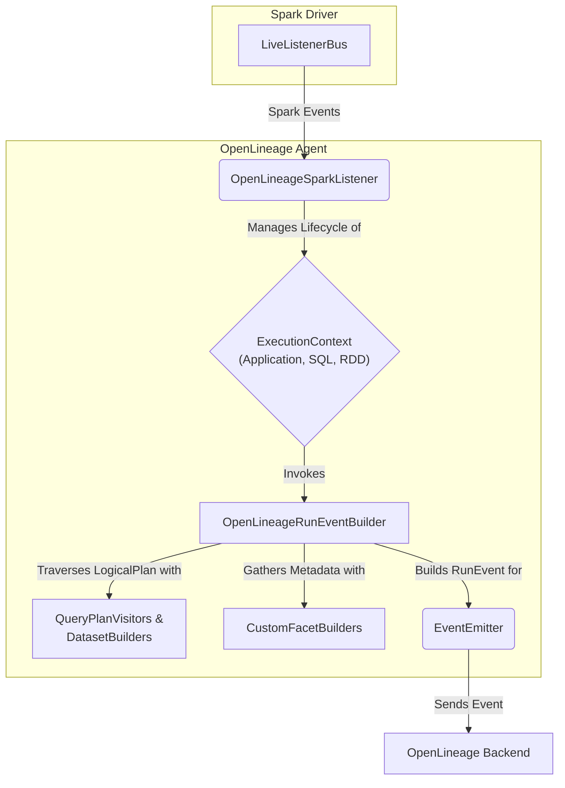
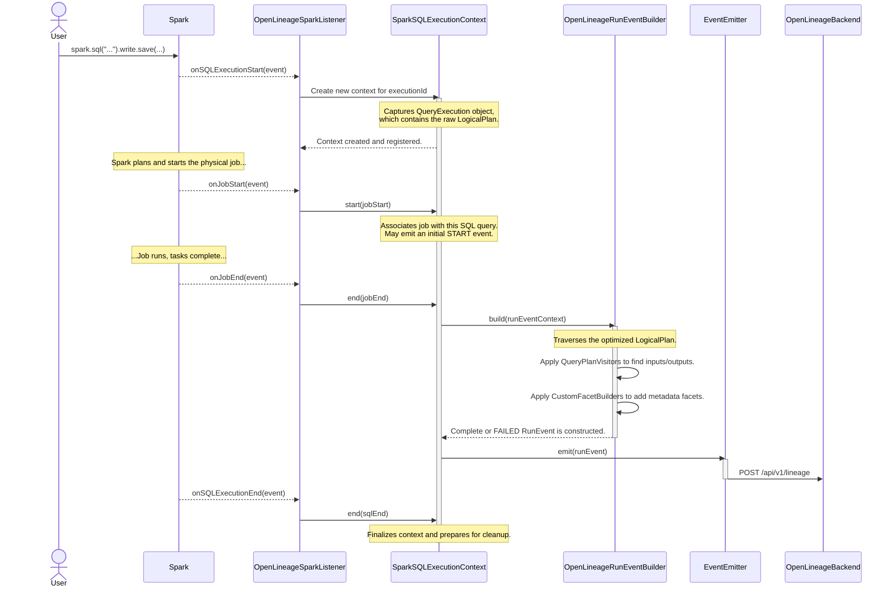

# Part 1: The Big Picture - How OpenLineage Intercepts Spark

This section provides a high-level overview of the OpenLineage Spark integration. It explains how the agent is loaded into a Spark application, introduces the core architectural components, and traces the end-to-end flow of an event from a Spark job to the OpenLineage backend.

---

## The `spark-submit` Journey & Agent Initialization

The journey of capturing lineage begins the moment a user executes a `spark-submit` command. The OpenLineage agent is not a standalone process; it's a Java agent that runs inside the Spark Driver's JVM. Here's how it gets there and comes to life:

1.  **Inclusion in Classpath**: The agent, packaged as a JAR file, must be made available to the Spark application's classpath. This is typically done in one of two ways:
    * `--jars /path/to/openlineage-spark.jar`: This command-line argument directly adds the agent JAR to the Spark Driver and Executor classpaths.
    * `--packages io.openlineage:openlineage-spark:<version>`: This argument tells Spark to fetch the agent and its dependencies from a Maven repository.

2.  **Listener Registration**: For the agent to receive information from Spark, it needs to be registered as a `SparkListener`. This is achieved by setting a specific Spark configuration property:
    * `--conf spark.extraListeners=io.openlineage.spark.agent.OpenLineageSparkListener`

3.  **Activation via `LiveListenerBus`**: When a `SparkSession` is initialized, Spark's `LiveListenerBus` is responsible for managing and posting events. During its setup, it reads the `spark.extraListeners` configuration. For each class listed, it uses Java reflection to create an instance of that listener. This is the moment the `io.openlineage.spark.agent.OpenLineageSparkListener` class is instantiated.

4.  **Agent Initialization Flow**:
    * **`onApplicationStart`**: The listener remains dormant until it receives the `SparkListenerApplicationStart` event. This is the first meaningful event that signals the Spark application is ready. Inside `OpenLineageSparkListener.java`:
        ```java
        @Override
        public void onApplicationStart(SparkListenerApplicationStart applicationStart) {
            if (isDisabled) {
                return;
            }
            log.debug("onApplicationStart()");
            initializeContextFactoryIfNotInitialized(applicationStart.appName());
            getSparkApplicationExecutionContext().start(applicationStart);
        }
        ```
    * **Context Factory Creation**: Inside the `onApplicationStart` method, the listener calls `initializeContextFactoryIfNotInitialized`. This critical method, shown below, performs the main setup:
        ```java
        // In OpenLineageSparkListener.java
        private void initializeContextFactoryIfNotInitialized(SparkConf sparkConf, String appName) {
          if (contextFactory == null) {
              // 1. Parse config from SparkConf, YAML, or environment variables
              SparkOpenLineageConfig openLineageConfig = ArgumentParser.parse(sparkConf);
    
              // 2. Initialize the client and emitter
              EventEmitter emitter;
          try {
              emitter = new EventEmitter(openLineageConfig, appName);
          } catch (URISyntaxException e) {
            log.error("Unable to create OpenLineage emitter", e);
            return;
          }

          // 3. Create the factory that will produce ExecutionContexts
          contextFactory = new ContextFactory(emitter, meterRegistry, openLineageConfig);
          log.info("OpenLineage listener context initialized.");
          }
        }
        ```
      This method orchestrates three key setup classes:
        * **`ArgumentParser`**: This utility class is responsible for reading all `spark.openlineage.*` configurations. It follows a clear precedence: SparkConf > environment variables > YAML file (`openlineage.yml`). This hierarchical approach allows for flexible configuration management.
        * **`EventEmitter`**: This class is the bridge to the outside world. It initializes the `OpenLineageClient`, which configures the underlying HTTP client (e.g., setting the target URL, authentication headers, timeouts) based on the parsed configuration. It also holds critical metadata like the `jobNamespace` and `parentRunId`.
        * **`ContextFactory`**: This factory is responsible for creating and managing different `ExecutionContexts` throughout the application's lifecycle. It is injected with the `EventEmitter` so that all created contexts can send events.
    * **Application-Level Lineage**: Once the `ContextFactory` is ready, a `SparkApplicationExecutionContext` is created. This context immediately builds and emits a `START` event for the entire Spark application run, establishing the parent run under which all subsequent job runs will be nested.

---

## Core Components & High-Level Architecture

The OpenLineage Spark agent is composed of several key components that work together to capture, process, and emit lineage events.


## Component Responsibilities

**Spark Driver / LiveListenerBus:** The heart of Spark's monitoring system. It emits a stream of events about the application's status, such as when a job, stage, or SQL query starts and ends. The agent is a passive observer of this stream.

**OpenLineageSparkListener:** The agent's main entry point. It implements `org.apache.spark.scheduler.SparkListener` to subscribe to the event stream from the `LiveListenerBus`. Its primary role is to delegate these events to the appropriate `ExecutionContext` and manage their lifecycles.

**ExecutionContext:** A state-holding object that manages the context of a specific Spark execution unit. This is a crucial concept for isolating lineage because it acts as a correlation mechanism. Spark emits a disjointed stream of events (`onJobStart`, `onTaskEnd`, etc.), and the `ExecutionContext` is responsible for correlating these individual events back to a single logical user operation (like a SQL query).

**OpenLineageRunEventBuilder:** The core orchestrator for constructing an `OpenLineage.RunEvent`. When an execution context finishes, this builder is invoked. It assembles the final event by delegating to specialized components. Crucially, it traverses Spark's `LogicalPlan` by using a set of version-specific `QueryPlanVisitors` that are loaded at runtime from the appropriate module (e.g., `spark2`, `spark3`).

**QueryPlanVisitors & DatasetBuilders:** These are specialized components, built using Scala's `PartialFunction`, that know how to inspect specific nodes within Spark's `LogicalPlan` tree. Their sole purpose is to extract `InputDataset` and `OutputDataset` objects. The `spark3` module, for example, contains a rich collection of these, including `AppendDataDatasetBuilder`, `MergeIntoCommandDatasetBuilder`, and several `DataSourceV2...` builders for modern data sources like Delta Lake and Iceberg.

**CustomFacetBuilders:** Facets are structured JSON snippets that attach rich, domain-specific metadata to OpenLineage events. These builders are also `PartialFunctions` that listen for various events or plan nodes to construct and attach these facets, such as an `ErrorFacet` for failed jobs.

**EventEmitter:** The final link in the agent's chain and the bridge to the core Java client. This component takes a fully-formed `RunEvent` and hands it to the `OpenLineageClient`. At this point, the Spark integration's job is complete. The `openlineage-java` client takes over, handling serialization to JSON, transport over the configured protocol (e.g., HTTP), and resilience patterns like circuit breaking.

### Concrete Example: Parsing a MERGE INTO Command

To make the abstract flow more concrete, let's see how the agent processes a common `MERGE INTO` command on a Delta Lake table.

1.  **Spark Creates the Plan:** A user executes a `MERGE` query. Spark parses this into a `LogicalPlan` that contains a `MergeIntoTable` node. This node represents the operation and holds references to the source and target tables.
2.  **Visitor Matching:** The `OpenLineageRunEventBuilder` begins traversing this `LogicalPlan`. It checks the plan against its list of registered visitors. The `MergeIntoCommandOutputDatasetBuilder` (from the `spark3` module) is specifically designed as a `PartialFunction` to match only `MergeIntoTable` nodes.
3.  **Catalog-Specific Identification:** Once matched, the builder extracts the table information. Because this is a Delta Lake operation, it delegates to the `DeltaHandler` (from the `lifecycle.plan.catalog` package). The `DeltaHandler` knows how to inspect Delta-specific properties to find the true identifier of the table (e.g., the underlying file path like `dbfs:/mnt/data/my_table`) and constructs a standardized OpenLineage `OutputDataset`. A similar process happens for the input table.
4.  **Column-Level Lineage Extraction:** The `OpenLineageRunEventBuilder` then invokes the column-level lineage logic. The `ColumnLevelLineageUtils` class traverses the expressions within the `MERGE` command's `UPDATE` and `INSERT` clauses. By using helpers like `ExpressionDependencyCollector`, it determines exactly which source columns are used to populate each target column, generating a `ColumnLineageFacet` that maps these relationships.
5.  **Event Finalization:** The collected datasets (inputs/outputs) and facets (column lineage) are assembled into a final `RunEvent`, which is then passed to the `EventEmitter` to be sent to the OpenLineage backend.

This example shows how generic orchestration (`OpenLineageRunEventBuilder`) combines with version-specific (`MergeIntoCommand...Builder`), catalog-specific (`DeltaHandler`), and task-specific (`ColumnLevelLineageUtils`) components to produce a rich lineage event.

## The End-to-End Event Flow

To see how these components interact, let's trace the lifecycle of a single Spark SQL query.

